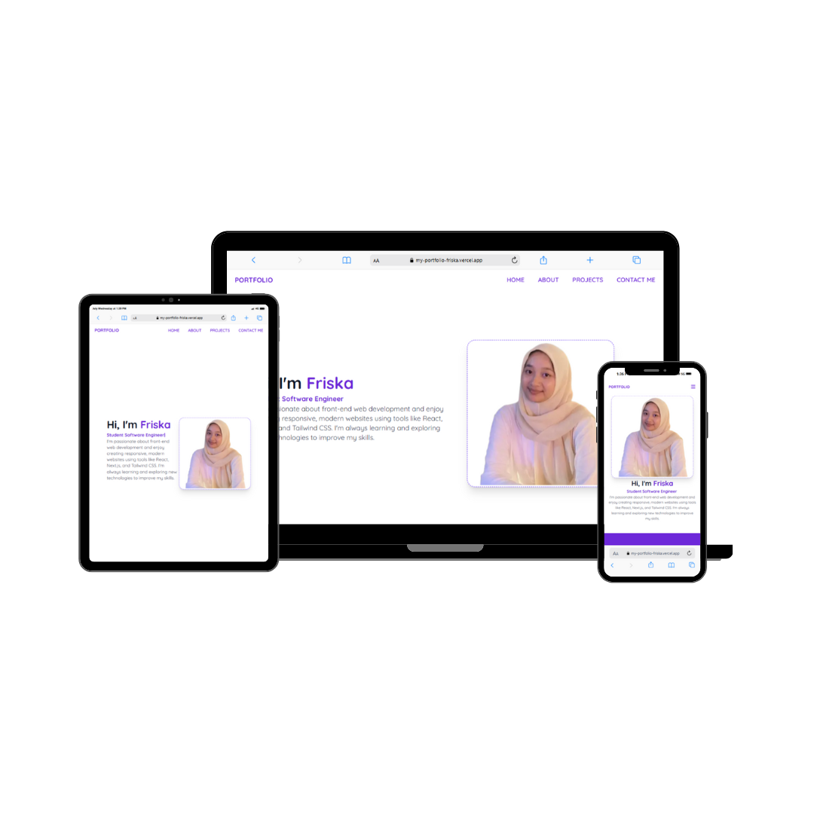
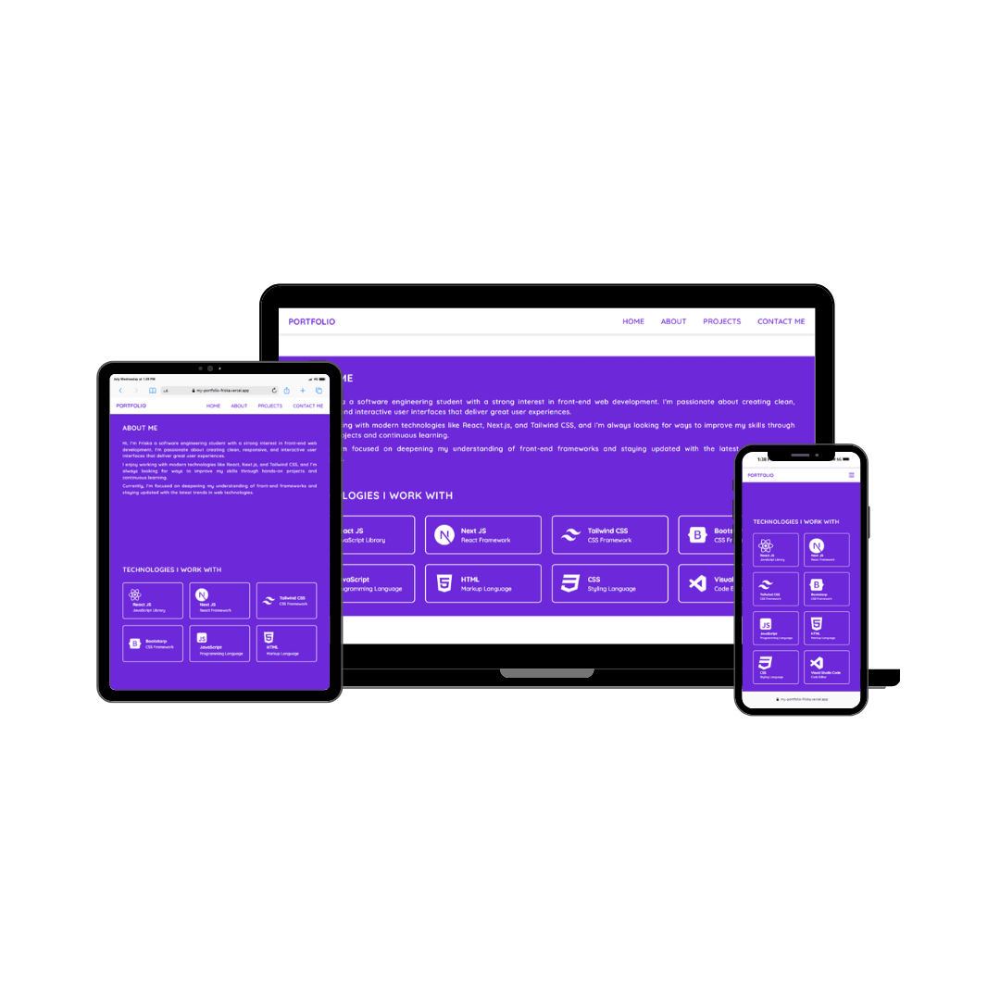

# 🎨 My Portfolio Website

This is my personal portfolio website built with Next.js and deployed on Vercel.

🔗 **Live site:** [my-portfolio-friska.vercel.app](https://my-portfolio-friska.vercel.app)

---

## 📁 Project Structure

- `pages/`: Main routes of the website
- `components/`: Reusable React components
- `public/`: Static assets (images, icons, etc.)

---

## ✨ Features

- Responsive design
- Project showcase section
- Contact form (using FormSubmit)
- Animated UI with Framer Motion
- Deployed to Vercel

---

## 🛠️ Tech Stack

- **Framework**: Next.js (React)
- **Styling**: Tailwind CSS
- **Animations**: Framer Motion
- **Deployment**: Vercel

---

## 📸 Screenshots





---

## 🚀 How to Run Locally

```bash
git clone https://github.com/friiskaa/my-portfolio.git
cd my-portfolio
npm install
npm run dev